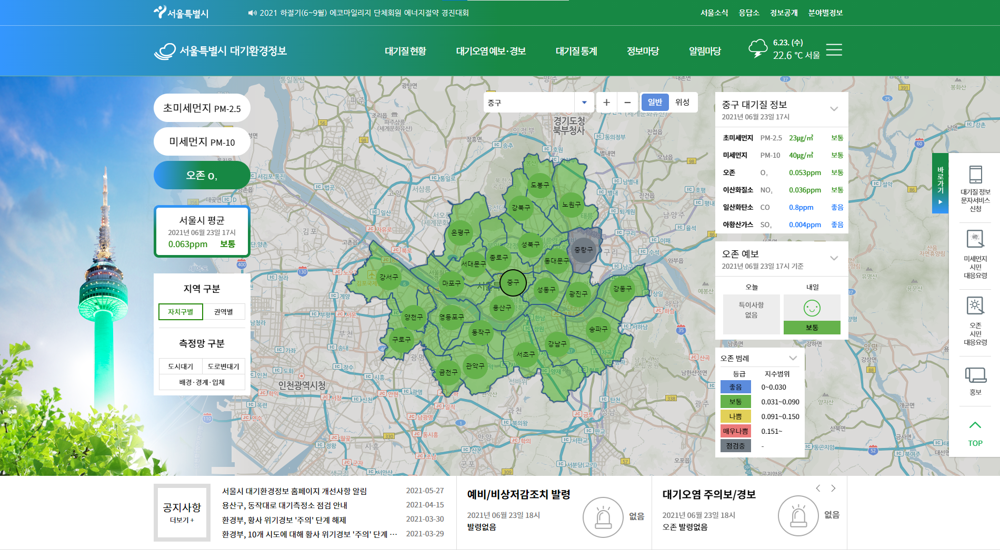
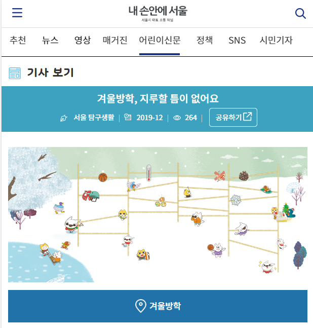
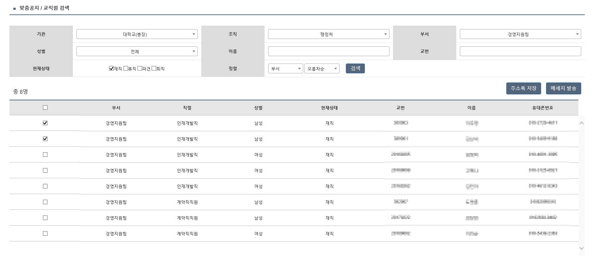
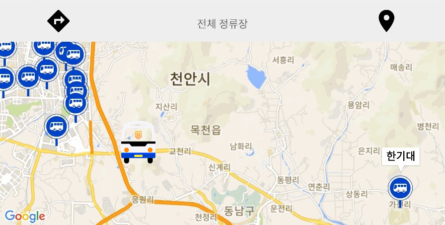

#### **서울특별시 대기환경정보(클린에어) 홈페이지 재구축 및 운영**

기간: 2020.01. ~ 2021.06. 
개발 환경/사용 기술: Java, eGovFrame, Spring Framework, JSP, MyBatis, HTML5, CSS, JavaScript, jQuery, axios, Oracle Database, IBM DataStage, Apache Tomcat, Apache HTTP Server

- 데이터 설계
- 애플리케이션 설계 및 개발
  - 대기질 정보 제공(지도 API, 도표, 그래프)
  - 정보 게시판
  - 관리자용 보고 시스템
- 웹 접근성 품질 인증 마크 획득
- 데이터스테이지 서버 운영(서버, ETL Job 관리)
- 서버 운영
  - Apache HTTP Server, Apache Tomcat 운영
  - 취약점 공격에 대한 조치(웹 서버에 Command Injection 방지 설정 등)
  - 스크립트를 이용해 주기적인 파일 백업
  - logrotate를 이용한 로그 관리

***
 

#### **서울시 어린이신문 '내친구서울' 홈페이지 구축 및 운영**

기간: 2019.06. ~ 2019.12. 
개발 환경/사용 기술: Java, eGovFrame, Spring Framework, JSP, MyBatis, HTML5, CSS, JavaScript, jQuery, Oracle Database, Wildfly, Apache HTTP Server

- 데이터 설계
- 데이터 마이그레이션(Oracle -> Oracle, MySQL -> Oracle)
- 애플리케이션 설계 및 개발
  - 신문 기사 페이지
  - 기자 게시판
  - 기자 신청 페이지
  - 관리 시스템
- 서버 운영
  - Apache HTTP Server, Wildfly 운영

***
 

#### **한국기술교육대학교 온라인 종합정보시스템 학사/행정 프로그램 개발 및 운영**

기간: 2016.07. ~ 2018.05. 
개발 환경/사용 기술: ActionScript3, FLEX, Java, eGovFramework, Oracle Database, Tomcat

- 애플리케이션 개발
  - 시내출장 관리
  - 외부강의 관리
  - 기술연구원 근무성적 평가

***
 

#### **한국기술교육대학교 통합 메시징 시스템 고도화**

기간: 2017.07. ~ 2017.09. 
개발 환경/사용 기술: Java, Spring Framework, Thymeleaf, MyBatis, HTML5, CSS, JavaScript, Bootstrap, jQuery, Oracle Database, Tomcat

- 애플리케이션 개발
  - 문자 메시지 또는 카카오톡 알림톡 수신 대상을 조회하는 맞춤공지 서비스

***
 

#### **KOBUS(졸업작품)**

기간: 2015.03. ~ 2015.09. 
개발 환경/사용 기술: Java, Android, Google Maps API

- 애플리케이션 개발
  - 셔틀버스의 위치정보를 실시간으로 조회할 수 있는 Android 애플리케이션

